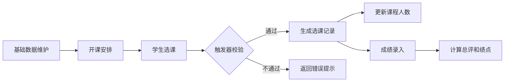
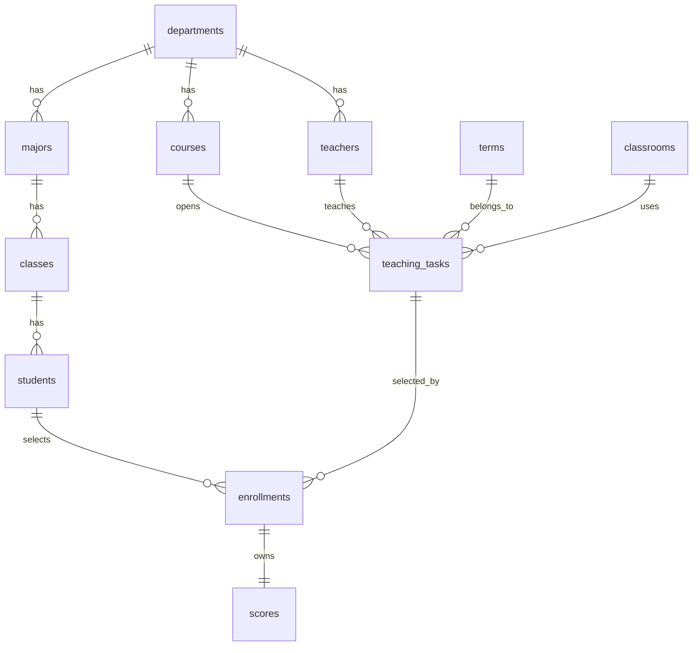

# 学生选课管理系统课程设计说明书

## 一、需求分析

### 1. 题目、语言和数据库

题目：学生选课管理系统。

开发语言：Python、HTML、CSS。

数据库：MySQL。

开发框架：Flask。

### 2. 系统需求

学生选课管理系统用于学校教务场景，主要解决学生信息维护、课程信息维护、教师开课、学生选课退课和成绩录入等问题。系统需要保证选课数据准确，能够限制课程容量，避免学生在同一学期同一时间段选择冲突课程，并对成绩进行自动计算。

系统主要用户包括教务管理员、教师和学生。课程设计作品中为了降低实现复杂度，Web 页面不做复杂登录权限控制，但数据库中保留 `users` 用户表，用于说明不同角色的扩展。

### 3. 功能需求

1. 学生管理：新增学生，维护学生所属班级、专业和学院信息。
2. 课程管理：新增课程，维护课程编号、名称、学分、学时和开课学院。
3. 开课管理：为课程安排教师、学期、教室、星期、节次和容量。
4. 选课管理：学生选择课程，系统检查容量、学生状态和课程时间冲突。
5. 退课管理：学生可退掉已选课程，并自动释放课程容量。
6. 成绩管理：教师录入平时成绩和考试成绩，数据库自动计算总评成绩和绩点。
7. 通知管理：管理员发布选课通知。

### 4. 数据流程

管理员维护基础数据，包括学院、专业、班级、学生、教师、教室、学期和课程。管理员创建开课任务后，学生进行选课。选课请求进入数据库后，触发器检查学生状态、课程容量和时间冲突，检查通过后写入选课记录并更新已选人数。课程结束后录入成绩，触发器自动计算总评和绩点。



## 二、概念结构设计

### 1. 实体

系统包含以下主要实体：

- 学院：保存学院名称。
- 专业：隶属于学院。
- 班级：隶属于专业。
- 学生：隶属于班级。
- 教师：隶属于学院。
- 教室：保存教学楼、教室号和容量。
- 学期：保存学期名称和起止日期。
- 课程：隶属于学院。
- 开课任务：连接课程、教师、学期和教室。
- 选课记录：连接学生和开课任务。
- 成绩：连接选课记录。
- 用户：保存系统角色账号。
- 通知：保存教务通知。
- 操作日志：记录关键业务操作。

### 2. 全局 E-R 图



## 三、逻辑结构设计

### 1. 主要关系模式

1. 学院 departments(`dept_id`, dept_name)
2. 专业 majors(`major_id`, dept_id, major_name)
3. 班级 classes(`class_id`, major_id, class_name, grade_year)
4. 学生 students(`student_id`, class_id, student_name, gender, phone, email, status, created_at)
5. 教师 teachers(`teacher_id`, dept_id, teacher_name, title, phone, email)
6. 教室 classrooms(`room_id`, building, room_no, capacity)
7. 学期 terms(`term_id`, term_name, start_date, end_date)
8. 课程 courses(`course_id`, dept_id, course_name, credit, hours)
9. 开课任务 teaching_tasks(`task_id`, course_id, teacher_id, term_id, room_id, weekday, start_section, end_section, max_students, current_students)
10. 选课记录 enrollments(`enroll_id`, student_id, task_id, select_time, status)
11. 成绩 scores(`score_id`, enroll_id, usual_score, exam_score, total_score, grade_point)
12. 用户 users(`user_id`, username, password, role, related_id, created_at)
13. 通知 notices(`notice_id`, title, content, publisher, publish_time)
14. 操作日志 operation_logs(`log_id`, action_type, detail, created_at)

### 2. 完整性约束

- 实体完整性：每张表均设置主键。
- 参照完整性：有联系的表均设置外键，例如学生引用班级、开课任务引用课程和教师、选课记录引用学生和开课任务。
- 用户定义完整性：学分、学时、教室容量、节次和成绩范围均设置检查约束。
- 唯一性约束：学院名称、课程编号、学生邮箱、教师邮箱、学生选同一开课任务等字段设置唯一约束。

## 四、物理结构设计

系统数据库名为 `course_selection`，字符集采用 `utf8mb4`。主要索引包括各表主键、唯一索引和外键索引。`enrollments` 表设置 `unique(student_id, task_id)`，防止同一学生重复选择同一开课任务。`teaching_tasks` 表通过触发器保证最大人数不超过教室容量。

## 五、数据库实施

数据库实施脚本位于 `sql/schema.sql`，执行后会完成以下内容：

1. 创建数据库和 13 张业务表。
2. 创建主键、外键、唯一约束、非空约束和检查约束。
3. 创建 6 个触发器。
4. 创建 6 个存储过程。
5. 创建 `v_student_course` 查询视图。
6. 插入学院、专业、班级、学生、教师、教室、学期、课程、开课和选课示例数据。

### 1. 存储过程

- `sp_add_student`：新增学生。
- `sp_add_course`：新增课程。
- `sp_open_course`：新增开课任务。
- `sp_select_course`：学生选课。
- `sp_drop_course`：学生退课。
- `sp_record_score`：录入成绩。

### 2. 触发器

- `trg_task_before_insert`：新增开课前检查教室容量和节次。
- `trg_task_before_update`：修改开课前检查容量是否合理。
- `trg_enroll_before_insert`：选课前检查学生状态、课程容量、最多选课门数和时间冲突。
- `trg_enroll_after_insert`：选课后更新当前人数，创建成绩空记录，写入日志。
- `trg_enroll_after_update`：退课或状态变化后更新当前人数并写入日志。
- `trg_score_before_update`：成绩更新前自动计算总评成绩和绩点。

## 六、系统实现

系统采用 Flask 实现后端路由，使用 PyMySQL 连接 MySQL 数据库，使用 Jinja2 模板渲染 HTML 页面。

主要文件说明：

- `app.py`：系统入口，包含数据库连接、路由和业务调用。
- `templates/`：HTML 页面模板。
- `static/style.css`：页面样式。
- `sql/schema.sql`：数据库创建脚本。

页面功能包括首页统计、学生管理、课程管理、开课管理、选课退课、成绩管理和通知管理。选课、退课和成绩录入均通过存储过程完成，关键业务规则由数据库触发器保证。

## 七、设计说明及体会

本系统按照数据库规范设计方法完成，先进行需求分析，再设计概念结构、逻辑结构和物理结构，最后实现数据库与应用系统。设计过程中将学生、课程、教师、学期、教室和选课记录拆分为独立实体，降低了数据冗余。通过外键保证数据之间的联系，通过触发器和存储过程封装关键业务规则，使系统具有一定的数据一致性和健壮性。

系统当前实现比较基础，适合作为课程设计作品。后续可以继续增加登录权限、分页查询、批量导入学生、教师端成绩管理、学生端个人课表和更完整的异常提示。

## 附录1 存储过程、触发器定义

详见 `sql/schema.sql` 中 `delimiter //` 到 `delimiter ;` 之间的内容。

## 附录2 数据查看、存储过程和触发器功能验证

可以执行以下 SQL 进行验证：

```sql
use course_selection;

select * from departments;
select * from students;
select * from teaching_tasks;
select * from enrollments;
select * from scores;
select * from operation_logs;

call sp_select_course('202301002', 2);
call sp_drop_course(1);
call sp_record_score(2, 88, 92);
select * from v_student_course;
```

时间冲突验证示例：

```sql
call sp_select_course('202301001', 1);
```

如果学生已经选择相同时间段课程，数据库会返回“课程时间冲突”或重复选课错误。

## 附录3 所有 SQL 运行语句

完整 SQL 语句见 `sql/schema.sql`。
