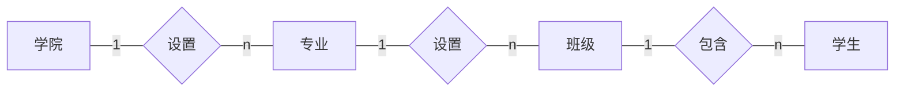
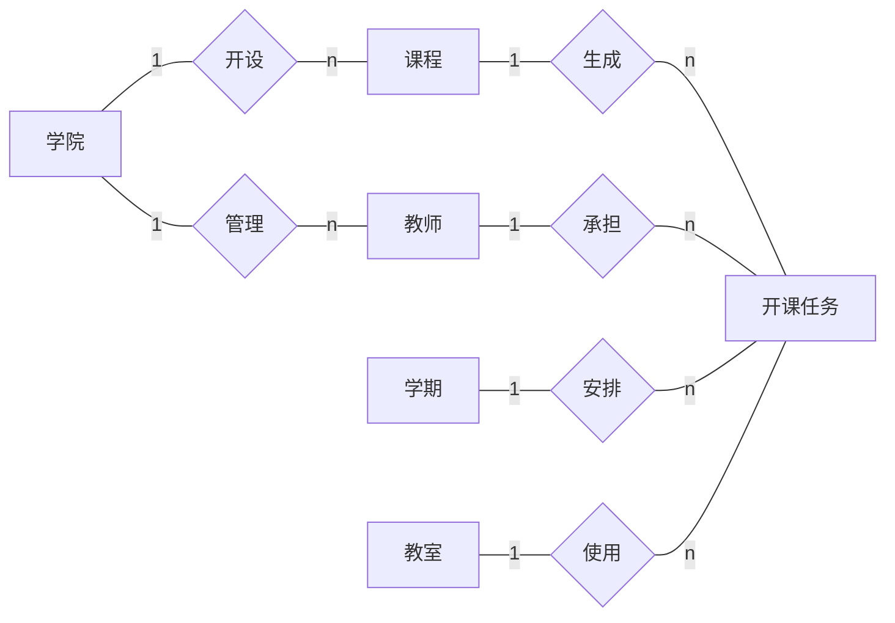
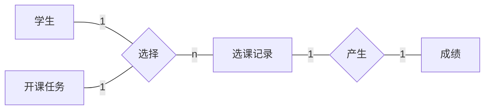
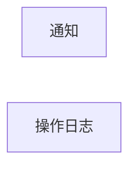
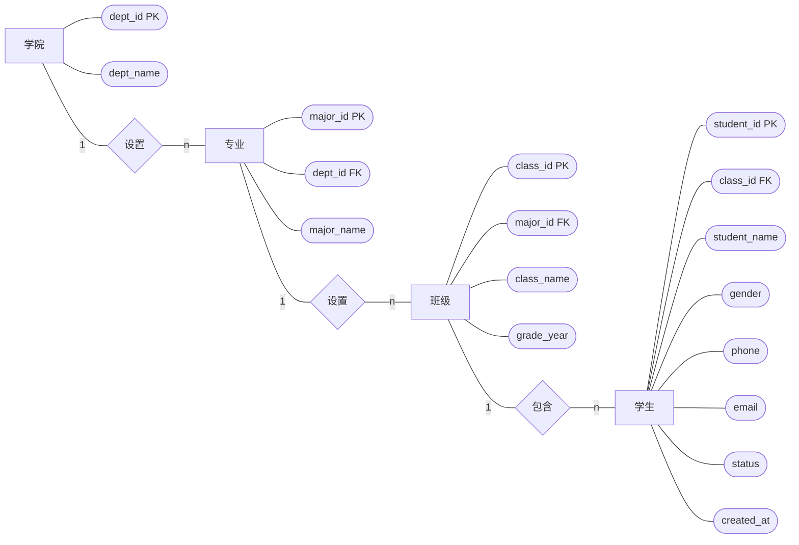
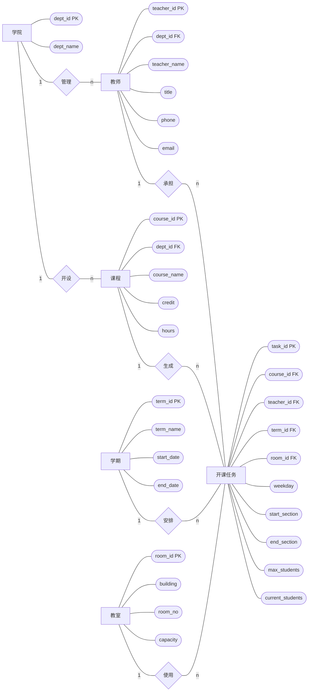
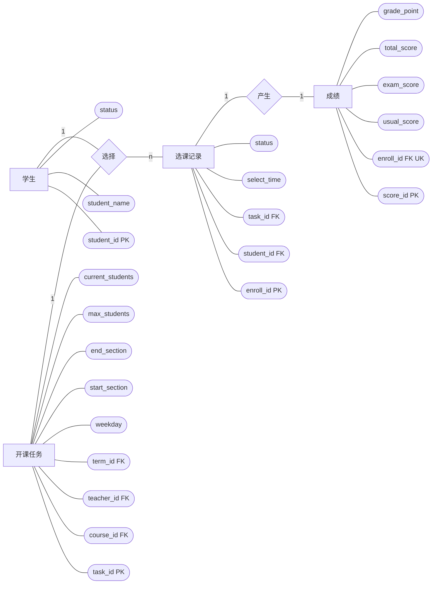
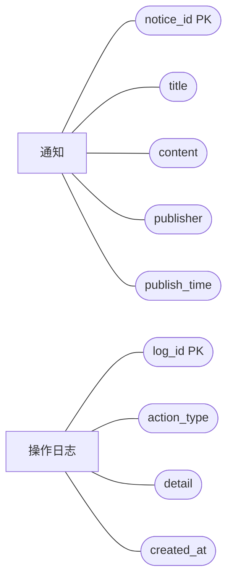
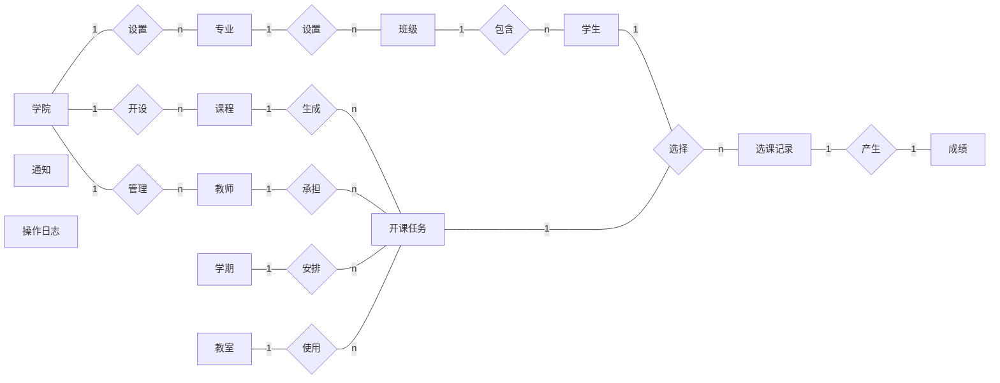

# 学生选课管理系统 E-R 设计

本文档依据 `sql/schema.sql` 中实际创建的数据库表整理。当前数据库共包含 13 个实体表：`departments`、`majors`、`classes`、`students`、`teachers`、`classrooms`、`terms`、`courses`、`teaching_tasks`、`enrollments`、`scores`、`notices`、`operation_logs`。

说明：本文采用传统 E-R 图表示法，矩形表示实体，椭圆表示属性，菱形表示联系；带下划线含义的主键属性在图中标注为“PK”，外键属性标注为“FK”。由于 Markdown/Mermaid 不能直接画标准椭圆下划线，图中使用圆角椭圆近似表示属性。

## 一、各子系统包含实体的 E-R 图

系统按业务边界划分为基础信息子系统、教学资源与开课子系统、选课与成绩子系统、通知与日志子系统。

| 子系统 | 包含实体 | 主要业务说明 |
| --- | --- | --- |
| 基础信息子系统 | 学院、专业、班级、学生 | 维护学校组织结构和学生基础档案。 |
| 教学资源与开课子系统 | 学院、教师、课程、学期、教室、开课任务 | 维护教学资源，并将课程安排到具体教师、学期、教室和时间段。 |
| 选课与成绩子系统 | 学生、开课任务、选课记录、成绩 | 完成学生选课、退课、人数维护和成绩计算。 |
| 通知与日志子系统 | 通知、操作日志 | 保存教务公告和关键业务操作记录。 |

### 1. 基础信息子系统实体 E-R 图

### 2. 教学资源与开课子系统实体 E-R 图

### 3. 选课与成绩子系统实体 E-R 图

说明：学生与开课任务原本是 m:n 联系，系统将其转换为中间实体“选课记录”，从而保存选课时间、选课状态等联系属性。

### 4. 通知与日志子系统实体 E-R 图

说明：通知和操作日志在当前数据库中不依赖其他业务表。通知用于发布教务公告；操作日志由选课相关触发器写入，但 `operation_logs` 表没有设置指向其他表的外键。

## 二、各子系统的局部 E-R 图

局部 E-R 图在实体关系基础上补充主要属性。

### 1. 基础信息子系统局部 E-R 图

关系说明：

| 联系 | 基数 | 说明 |
| --- | --- | --- |
| 学院-专业 | 1:n | 一个学院可以设置多个专业，一个专业只能隶属于一个学院。 |
| 专业-班级 | 1:n | 一个专业可以设置多个班级，一个班级只能隶属于一个专业。 |
| 班级-学生 | 1:n | 一个班级包含多名学生，一名学生只能属于一个班级。 |

### 2. 教学资源与开课子系统局部 E-R 图

关系说明：

| 联系 | 基数 | 说明 |
| --- | --- | --- |
| 学院-教师 | 1:n | 一个学院可以有多名教师，一名教师隶属于一个学院。 |
| 学院-课程 | 1:n | 一个学院可以开设多门课程，一门课程归属一个学院。 |
| 课程-开课任务 | 1:n | 同一门课程可以在不同学期、不同教师或不同班次多次开课。 |
| 教师-开课任务 | 1:n | 一名教师可以承担多个开课任务，一个开课任务由一名教师承担。 |
| 学期-开课任务 | 1:n | 一个学期包含多个开课任务，一个开课任务属于一个学期。 |
| 教室-开课任务 | 1:n | 一个教室可被多个不同时段的开课任务使用，一个开课任务使用一个教室。 |

### 3. 选课与成绩子系统局部 E-R 图

关系说明：

| 联系 | 基数 | 说明 |
| --- | --- | --- |
| 学生-选课记录 | 1:n | 一名学生可以产生多条选课记录，一条选课记录只属于一名学生。 |
| 开课任务-选课记录 | 1:n | 一个开课任务可被多名学生选择，一条选课记录只对应一个开课任务。 |
| 学生-开课任务 | m:n | 通过中间实体 `enrollments` 分解为两个 1:n 联系。 |
| 选课记录-成绩 | 1:1 | 每条选课记录自动生成一条成绩记录，`scores.enroll_id` 设置唯一约束。 |

### 4. 通知与日志子系统局部 E-R 图

关系说明：

| 实体 | 说明 |
| --- | --- |
| 通知 | 独立保存教务通知，当前未设置发布人外键，使用 `publisher` 保存发布者名称。 |
| 操作日志 | 独立保存业务操作记录，由选课相关触发器写入，当前未设置业务对象外键。 |

## 三、解决冲突说明

各子系统局部 E-R 图合并为全局 E-R 图时，主要处理以下冲突。

### 1. 命名冲突

| 冲突类型 | 表现 | 解决方式 |
| --- | --- | --- |
| 实体命名不一致 | 教务场景中“院系”“学院”含义接近。 | 统一命名为“学院”，对应表 `departments`。 |
| 主键命名不统一 | 不同实体可能都使用“编号”作为描述。 | 按实体分别命名为 `dept_id`、`major_id`、`class_id`、`student_id`、`teacher_id`、`course_id` 等。 |
| 班级英文命名冲突 | `class` 容易与程序语言关键字或语义冲突。 | 数据库表统一使用复数形式 `classes`。 |
| 课程与开课混用 | “课程”可能既表示课程目录，也表示某学期具体教学班。 | 将课程目录定义为 `courses`，将具体开课安排定义为 `teaching_tasks`。 |

### 2. 属性冲突

| 冲突类型 | 表现 | 解决方式 |
| --- | --- | --- |
| 编号类型冲突 | 学号、工号、课程号通常有业务编码；学院、专业等适合系统自增编号。 | `student_id`、`teacher_id`、`course_id` 使用 `varchar`；其他内部编号使用 `int auto_increment`。 |
| 联系属性归属冲突 | 学期、教室、上课时间、容量既可能放在课程表，也可能放在教师授课表。 | 这些属性属于具体开课安排，统一放入 `teaching_tasks`。 |
| 成绩计算属性冲突 | 总评成绩和绩点可由平时分、考试分计算得到。 | 在 `scores` 中保留 `total_score`、`grade_point`，通过触发器自动计算，便于查询和统计。 |
| 状态取值冲突 | 学生状态、选课状态如果自由填写会造成数据不一致。 | 使用 `enum` 限定学生状态为“在读、休学、毕业”，选课状态为“已选、退选、完成”。 |

### 3. 结构冲突

| 冲突类型 | 表现 | 解决方式 |
| --- | --- | --- |
| 学生与课程的多对多联系 | 一名学生可选多门课，一门课也可被多名学生选择。 | 增加中间实体 `enrollments`，保存选课时间和选课状态。 |
| 课程和教师的多对多联系 | 一门课程可由不同教师在不同学期开设，一名教师可教多门课程。 | 不直接建立课程-教师多对多关系，统一通过 `teaching_tasks` 表表达。 |
| 开课任务与成绩的关系不清 | 成绩不能只挂在学生或课程上，否则无法区分具体开课班次。 | 成绩挂接到 `enrollments`，即“某学生选择某开课任务”的结果。 |
| 教室容量与开课容量约束冲突 | 开课人数可能超过教室容量。 | `teaching_tasks.max_students` 由触发器检查，不能超过 `classrooms.capacity`。 |
| 当前选课人数冗余 | `current_students` 可由选课记录统计，也保存在开课任务中。 | 作为冗余统计字段保留，由选课、退课触发器维护，提升页面查询效率。 |

### 4. 业务规则冲突

| 业务规则 | 处理方式 |
| --- | --- |
| 非在读学生不能选课 | `trg_enroll_before_insert` 检查 `students.status`。 |
| 课程容量不能超限 | 选课前检查 `max_students - current_students`。 |
| 同一学生不能重复选择同一开课任务 | `enrollments` 设置唯一约束 `uk_student_task(student_id, task_id)`。 |
| 学生同一时间不能选择冲突课程 | 触发器比较同一学期、同一星期、节次有交叉的已选课程。 |
| 每名学生最多选择 8 门课程 | 触发器统计该学生状态为“已选”的记录数量。 |
| 成绩范围必须合法 | `scores` 表对平时分、考试分、总评分设置 0 到 100 的检查约束。 |

## 四、全局 E-R 图

全局 E-R 图用于展示所有实体之间的整体联系。为保证版面清晰，全局图只保留实体、联系和基数；详细属性已经在各子系统局部 E-R 图中列出。

全局关系总结：

| 实体关系 | 基数 | 数据库实现 |
| --- | --- | --- |
| 学院-专业 | 1:n | `majors.dept_id` 外键引用 `departments.dept_id`。 |
| 专业-班级 | 1:n | `classes.major_id` 外键引用 `majors.major_id`。 |
| 班级-学生 | 1:n | `students.class_id` 外键引用 `classes.class_id`。 |
| 学院-教师 | 1:n | `teachers.dept_id` 外键引用 `departments.dept_id`。 |
| 学院-课程 | 1:n | `courses.dept_id` 外键引用 `departments.dept_id`。 |
| 课程-开课任务 | 1:n | `teaching_tasks.course_id` 外键引用 `courses.course_id`。 |
| 教师-开课任务 | 1:n | `teaching_tasks.teacher_id` 外键引用 `teachers.teacher_id`。 |
| 学期-开课任务 | 1:n | `teaching_tasks.term_id` 外键引用 `terms.term_id`。 |
| 教室-开课任务 | 1:n | `teaching_tasks.room_id` 外键引用 `classrooms.room_id`。 |
| 学生-开课任务 | m:n | 通过 `enrollments` 分解；`enrollments.student_id` 和 `enrollments.task_id` 分别引用学生与开课任务。 |
| 选课记录-成绩 | 1:1 | `scores.enroll_id` 外键引用 `enrollments.enroll_id`，并设置唯一约束。 |
